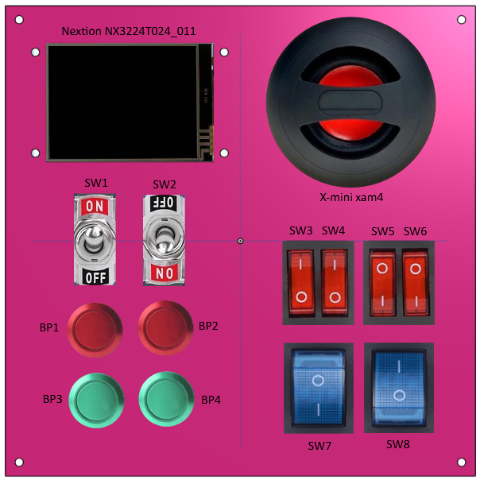

# Rabbit Control Center

Ce dossier contient le programme de lecture des 4 boutons poussoirs normalement ouverts et des 8 interrupteurs présents sur la façade suivante :



Le programme est à destination d'un Arduino Nano v3.

Il stream périodiquement sur la liaison série l'état de tous les boutons/interrupteurs sous forme de "0" ou "1" séparés par des ";".

Exemple :

```
0;1;0;0;0;0;1;0
1;1;0;0;0;0;1;0
1;0;0;0;0;0;0;0
// etc...
```
